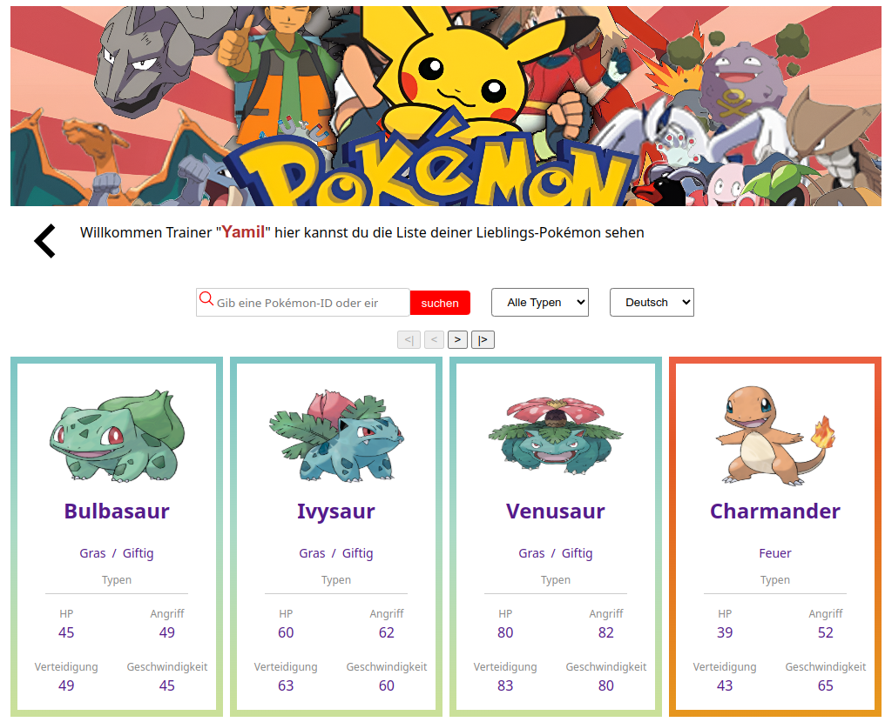
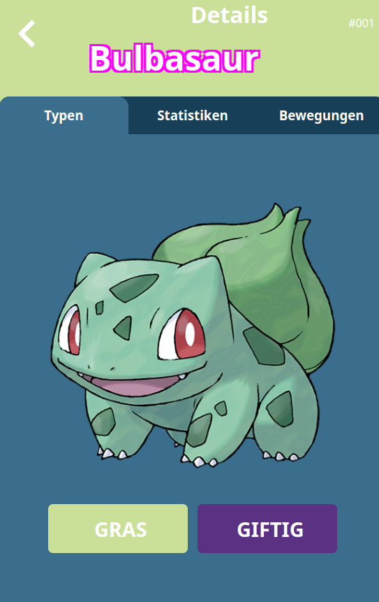

# Ultimate Pokemon Bestiary Go 

## Pokedex!

This web application, built with ReactJS and Vite, allows you to search and list monsters from the Pokemon series. It features pagination for records, uses react-icons.github.io icons, them changer. It consumes a Pokemon REST API (https://pokeapi.co/).



## Features

- **Public and Protected Routes:** Using react-router-dom for route management.

- **Intuitive Interface:** Modern, responsive, and user-friendly design, optimized for different devices.

- **Reusable Components:** Modular code structure for easy maintenance.

- **Hooks:** Utilizes hooks including useState, useEffect, useRef, react-router-dom, UseReducer, Global State, routes, and a custom hook for API connection and pagination.

- **Languages:** Enjoy the experience in your preferred language, including German, Italian, Turkish, and English.

- **Theme Changer:** Allows to change between Light, Dark and colorful themes. 

- **CSS:** Styling for the application.

- **ReactJS:** JavaScript framework for creating user interfaces.

- **Vite:** Fast frontend build tool based on ES modules.

- **react-icons.github.io Icons:** Custom icons to enhance the interface.

- **License:** MIT, can be used for any personal or commercial project while maintaining this README.md, the author's name, and the MIT license.

You can visit the online platform at [https://pokedex-fmg.vercel.app/](https://pokedex-fmg.vercel.app/)

## System Requirements

- **Operating System:** Ubuntu 22.04.4 LTS or Windows 10 Pro 1803 

- **NodeJS:** Version 18.20.4 or higher 

- **npm/npx:** Version 10.8.4 or higher 

- **Vite:** Version 5.4 or higher 

- **ReactJs:** Version 18.3 or higher
    
## Alternative Systems Tested

The project has also been tested in the following alternative environment:

- **Operating System:** Windows 10 Pro 1803

- **NodeJS:** 18.20.4

- **npm/npx:** Version 10.8.4 or higher 

- **Vite:** Version 5.4 or higher 

- **ReactJs:** Version 18.3 or higher 

## Contributions
Contributions are welcome. If you find any errors or wish to add new features, feel free to open an issue, pull request, or fork the repository.

## Images

Pokemon detail screen 



## Useful Commands

View system information:

uname -r

sb_release -a

node -v

npm -v

## Project Structure

The project structure is:
```
index.html
readme.md
└── src/
├── index.css
├── main.jsx
├── app/
│   ├── Detail.jsx
│   ├── Home.jsx
│   ├── index.js
│   └── pokdex.jsx
├── containers/
│    └── languaje.jsx
├── contexts/
│    └── nameContext.jsx
├── languajes/
│    ├──── de.json
│    ├──── en.json
│    ├──── es.json
│    ├──── index.js
│    ├──── it.json
│    └──── tr.json
├── routes/
│    ├──── AppRouters.jsx
│    └──── ProtectedRoutes.jsx
├── styles/
│    ├──── details.css
│    ├──── filters.css
│    ├──── home.css
│    ├──── nofound.css
│    ├──── pokeCard.css
│    ├──── pokedex.css
│    ├──── pokelist.css
│    └──── search.css
├── components/
│    ├── LanguageSelector.jsx
│    ├── LanguageSelector.jsx
│    └── pokedex/
│        ├── Filtes.jsx
│        ├── notfound.jsx
│        ├── PokemoCard.jsx
│        ├── PokemonList.jsx
│        ├── Search.jsx
│        ├── Search.jsx
│        └── UserCard.jsx
├── hooks/
│   └── useFetch.jsx
├── layout/
│   └── Layout.jsx
└──  assets/
└── img/
├── home_bg.png
├── pokedex.png
└── hero.png
```
# Installation

To install, download the project from the repository:

```bash
git clone https://github.com/fabinnerself/E5-pokedex-fmg.git

Then run:

cd E5-pokedex-fmg

npm i axios react-icons react-router-dom
```
(C) Favian M.G. 2024