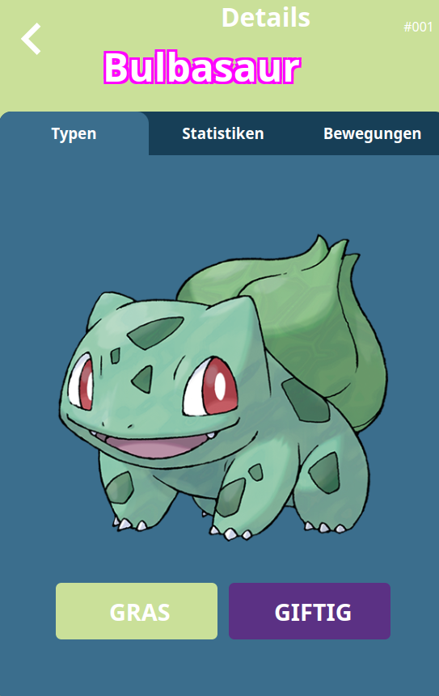

# Ultimate Pokemon Bestiary Go 

## Pokedex App!

Esta aplicación web, construida con ReactJS y Vite, te permite buscar y listar monstruos de la serie pokemon. Tiene paginacion en los registros. Uso de iconos react-icons.github.io, uso de ventanas modales para mensajes de alerta en las operaciones. COnsume una rest api de pokemon (https://pokeapi.co/).


## Caracteristicas

- **Rutas publicas y protegidas:** Rutas publicas y protegidas con react-router-dom.

- **Interfaz intuitiva:** Diseño moderno responsivo y fácil de usar, optimizado para diferentes dispositivos.

- **Componentes reutilizables:** : Estructura modular del código para facilitar el mantenimiento.

- **Hooks:** Utiliza los hooks useState, useEffect, useRef, react-router-dom, UseReducer, Global State, routes y Custom hook personalizado para la conexión a la rest api y paginacion. 

-**Idiomas**  Disfruta de la experiencia en tu idioma preferido inclueyndo Aleman, Italiano, Turco, e Ingles. 

- **CSS:**  Estiliza la aplicación. 

- **ReactJS:**  Framework JavaScript para crear interfaces de usuario. 

- **Vite:**  Herramienta de construcción de frontend rápida y basada en ES modules. 

- **Iconos react-icons.github.io:** : Iconos personalizados para mejorar la interfaz.

- **Licencia:**  MIT se puede usar para cualquier proyecto personal o comercial mientras se mantenga este README.md, mi nombre y la licencia MIT.
 
Puedes visitar la plataforma en línea en [https://pokedex-fmg.vercel.app/](https://pokedex-fmg.vercel.app/)

## Requisitos del Sistema

- **Sistema Operativo:** Ubuntu 22.04.4 LTS o Windows 10 Pro 1803 

- **NodeJS:** Versión 18.20.4 o superior 

- **npm/npx:** Versión 10.8.4 o superior 

- **Vite::** version 5.4 o superior 

- **ReactJs:** vesion 18.3 o superior 
    
## Sistemas Alternativos Probados

El proyecto también ha sido probado en el siguiente entorno alternativo:

- **Sistema Operativo:** Windows 10 Pro 1803

- **NodeJS:** NodeJS: 18.20.4

- **npm/npx:** Versión 10.8.4 o superior 

- **Vite:** version 5.4 o superior 

- **ReactJs:** vesion 18.3 o superior 

## Contribuciones
Las contribuciones son bienvenidas. Si encuentras algún error o deseas agregar nuevas funcionalidades, no dudes en abrir un issue, una pull  request, o fork en el repositorio.

## Imagenes

Pantalla  detalle pokemon 



## Comandos Útiles

Ver información del sistema:

uname -r

sb_release -a

node -v

npm -v

## Estructura del proyecto

La estructura del proyecto es:
```
index.html
readme.md
└── src/
    ├── index.css
    ├── main.jsx
    ├── app/
    │   ├── Detail.jsx
    │   ├── Home.jsx
    │   ├── index.js
    │   └── pokdex.jsx
    ├── containers/
    │    └── languaje.jsx
    ├── contexts/
    │    └── nameContext.jsx   
    ├── languajes/     
    │    ├──── de.json   
    │    ├──── en.json   
    │    ├──── es.json   
    │    ├──── index.js
    │    ├──── it.json 
    │    └──── tr.json   
    ├── routes/  
    │    ├──── AppRouters.jsx   
    │    └──── ProtectedRoutes.jsx
    ├── styles/
    │    ├──── details.css   
    │    ├──── filters.css
    │    ├──── home.css
    │    ├──── nofound.css
    │    ├──── pokeCard.css
    │    ├──── pokedex.css
    │    ├──── pokelist.css
    │    └──── search.css
    ├── components/
    │    ├── LanguageSelector.jsx
    │    ├── LanguageSelector.jsx
    │    └── pokedex/
    │        ├── Filtes.jsx
    │        ├── notfound.jsx
    │        ├── PokemoCard.jsx
    │        ├── PokemonList.jsx
    │        ├── Search.jsx
    │        ├── Search.jsx
    │        └── UserCard.jsx
    ├── hooks/
    │   └── useFetch.jsx
    ├── layout/        
    │   └── Layout.jsx
    └──  assets/
        └── img/
           ├── home_bg.png
           ├── pokedex.png           
           └── hero.png

```
# Instalación

Para instalar bajar el proyecto del repositorio:

```bash

git clone https://github.com/fabinnerself/E5-pokedex-fmg.git

luego correr:

cd  E5-pokedex-fmg

npm i axios  react-icons react-router-dom   
```

(C) Favian M.G. 2024 
